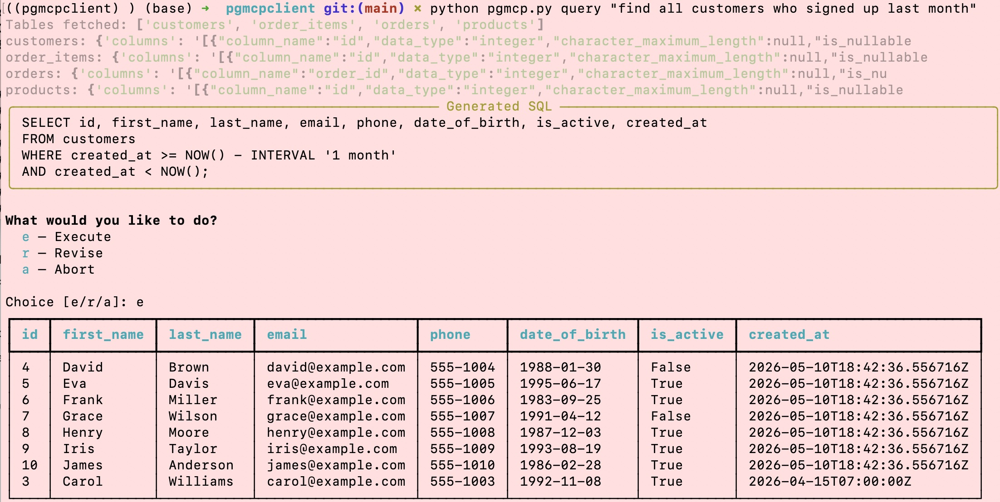

# pg-mcp CLI

A command line tool for interacting with PostgreSQL databases using natural language and schema files, powered by [pg-mcp-server](https://github.com/stuzero/pg-mcp-server) and [Ollama](https://ollama.com).



---

## Features

- **Create tables** from schema definitions stored in CSV, Excel (.xlsx), or plain text files
- **Translate plain English** to SQL by pulling live schemas from the database
- **Inspect schemas** for any table
- **List all tables** in the database
- **Seed sample data** with a standalone script
- **Local LLM** — uses Ollama (qwen2.5) — no cloud API keys required

---

## Prerequisites

- Python 3.12+
- [Ollama](https://ollama.com) running locally with `qwen2.5` pulled
- PostgreSQL running locally
- [pg-mcp-server](https://github.com/stuzero/pg-mcp-server) running in the background

---

## Part 1 — Install and run pg-mcp-server

### 1. Clone and install

```bash
git clone https://github.com/stuzero/pg-mcp-server.git
cd pg-mcp-server

# Install dependencies (requires Python 3.12+)
pip install -e .

# Activate the virtual environment
source .venv/bin/activate
```

### 2. Patch for write access

By default pg-mcp-server runs in read-only mode. To allow CREATE TABLE and INSERT:

**Fix 1 — `server/database.py`** (line ~93):

```bash
sed -i '' 's/"default_transaction_read_only": "true"/"default_transaction_read_only": "false"/' server/database.py
```

**Fix 2 — `server/tools/query.py`** (comment out the read-only transaction line):

```bash
sed -i '' 's/await conn.execute("SET TRANSACTION READ ONLY")/#await conn.execute("SET TRANSACTION READ ONLY")/' server/tools/query.py
```

### 3. Run in the background

```bash
# Quick background run (doesn't survive reboot)
nohup python -m server.app > ~/logs/pg-mcp.log 2>&1 &

# Verify it's running
curl -s http://localhost:8000/sse | head -3
# Expected: event: endpoint
```

### 4. Available tools

Once running, pg-mcp-server exposes 5 tools over SSE:

| Tool | Description |
|---|---|
| `connect` | Register a PostgreSQL connection string, returns `conn_id` |
| `disconnect` | Close a database connection |
| `pg_query` | Execute SQL using a `conn_id` |
| `pg_explain` | Analyze query execution plans |
| `pg_metadata` | Produce visualization metadata for a query |

---

## Part 2 — Install the CLI

### 1. Clone this repo

```bash
git clone https://github.com/YOUR_USERNAME/pg-mcp-cli.git
cd pg-mcp-cli
```

### 2. Create a virtual environment with Python 3.12

```bash
python3.12 -m venv .venv
source .venv/bin/activate
pip install --upgrade pip
pip install mcp langchain langchain-ollama langchain-community rich openpyxl sqlparse python-dotenv
```

### 3. Configure environment

```bash
cp .env.example .env
```

Edit `.env`:

```bash
PG_MCP_URL=http://localhost:8000/sse
DATABASE_URL=postgresql://postgres@localhost:5432/your_database
OLLAMA_BASE_URL=http://localhost:11434
OLLAMA_MODEL=qwen2.5
```

> **No password?** If your local PostgreSQL uses trust auth (common with Homebrew installs),
> omit the password: `postgresql://postgres@localhost:5432/mydb`

### 4. Pull the Ollama model

```bash
ollama pull qwen2.5
```

---

## Usage

### Create a table from a schema file

```bash
# From CSV
python pgmcp.py create --file customers.csv

# From Excel
python pgmcp.py create --file products.xlsx --sheet products --table products

# From plain text
python pgmcp.py create --file orders.txt --table orders
python pgmcp.py create --file orders_items.txt --table orders_items
```

### Translate plain English to SQL

```bash
python pgmcp.py query "show all active customers"
python pgmcp.py query "total revenue per product category this year"
python pgmcp.py query "find all orders placed in the last 30 days"
python pgmcp.py query "show all orders with customer first and last name"
```


### Inspect the database

```bash
# List all tables
python pgmcp.py tables

# Show schema for a specific table
python pgmcp.py schema orders
python pgmcp.py schema customers
```

### Seed sample data

```bash
# Seed all tables
python seedtables.py

# Seed specific tables
python seed.py customers
python seed.py products orders
```

---

## Schema file formats

### CSV (`.csv`)

Header row required. Column order flexible.

```csv
name,type,size,nullable,default,primary_key
id,serial,,,false,true
first_name,varchar,100,false,,
email,varchar,200,false,,
is_active,boolean,,false,true,
created_at,timestamp,,,NOW(),
```

### Plain text (`.txt`)

One column per line: `name type size [not null] [default value]`

```
# Comments start with #
order_id    serial
customer_id integer   not null
status      varchar   50   not null   default 'pending'
total       numeric   12,2
created_at  timestamp not null  default NOW()
```

### Excel (`.xlsx`)

Same structure as CSV — headers in row 1, one column per row.

---

## Project structure

```
pg-mcp-cli/
├── pgmcp.py           # Main CLI tool
├── seed.py            # Standalone data seeder
├── .env.example       # Environment variable template
├── requirements.txt   # Python dependencies
└── samples/
    ├── customers.csv  # Sample CSV schema
    ├── orders.txt     # Sample text schema
    └── products.xlsx  # Sample Excel schema
```

---

## Troubleshooting

| Error | Fix |
|---|---|
| `connection refused :8000` | pg-mcp-server not running — start it with `python -m server.app` |
| `database does not exist` | Check `DATABASE_URL` in `.env` — run `psql -U postgres -c "\l"` to list databases |
| `read-only transaction` | Apply the two patches in Part 1 Step 2 and restart pg-mcp-server |
| `ModuleNotFoundError` | Activate the venv — `source .venv/bin/activate` — then reinstall |
| `conn_id validation error` | pg-mcp returns JSON-wrapped conn_id — ensure `_extract_conn_id()` is in `pgmcp.py` |
| Wrong columns in generated SQL | Schema fetch returning empty — check `pg_metadata` tool arguments |

---

## License

MIT
